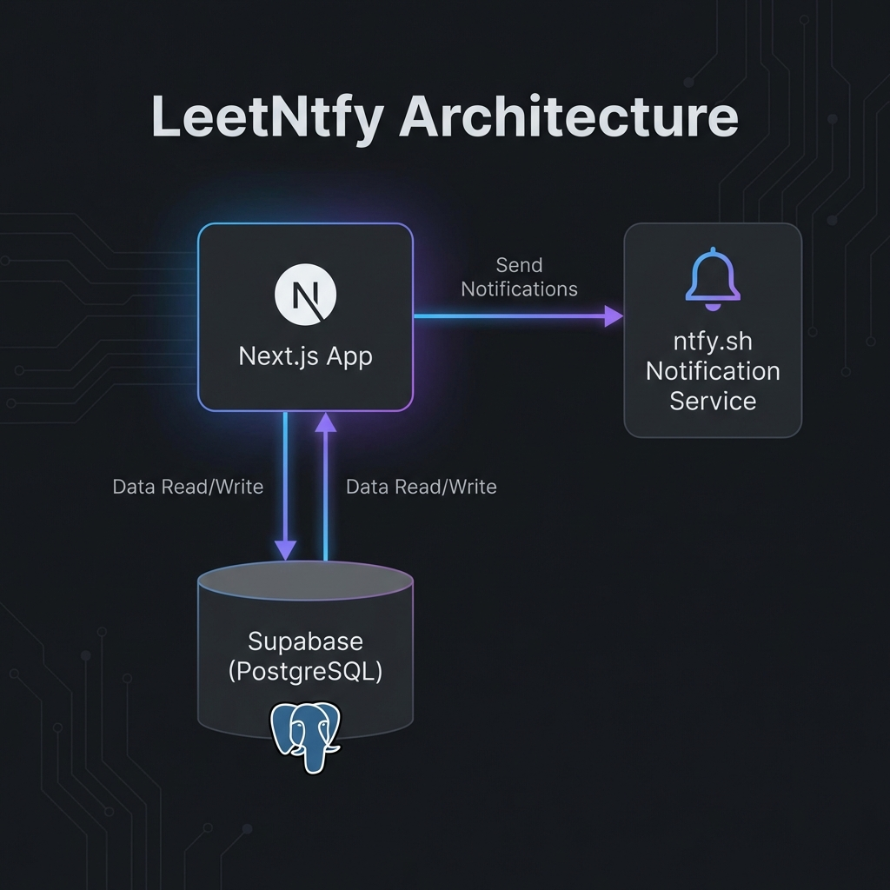

# LeetNtfy

## Table of Contents
- [Description](#description)
- [Sneak-Peek](#sneak-peek)
- [Getting Started](#getting-started)
- [Contributing](#contributing)
- [What I Learned](#what-i-learned)
- [Questions?](#questions)

## Description
**LeetNtfy** is a personalized LeetCode study notification system designed to keep you consistent with your coding practice. By leveraging the power of `ntfy.sh` and Supabase, LeetNtfy sends tailored algorithm challenges directly to your phone or desktop based on the topics you are currently studying.

This application simplifies the study workflow:
- **No-Password Access**: Use a unique secret link to manage your settings.
- **Personalized Topics**: Add the topics you've recently studied to your "Random List" for targeted practice.
- **One-Tap Management**: Every notification includes a link to instantly adjust your settings.
- **Cloud Persistence**: Your progress and preferences are securely stored in Supabase.

## Sneak-Peek
### Architecture Diagram


## Getting Started
### Prerequisites
- Node.js (v18+)
- npm or yarn
- A Supabase account and project
- The [ntfy](https://ntfy.sh) app installed on your device

### 1. Project Setup
Clone the project and install dependencies:
```bash
npm install
```

### 2. Environment Configuration
Create a `.env.local` file with your Supabase credentials:
```env
NEXT_PUBLIC_SUPABASE_URL=your-project-url
NEXT_PUBLIC_SUPABASE_ANON_KEY=your-anon-key
```

### 3. Database Schema
Initialize your Supabase database with the following table:
```sql
CREATE TABLE users (
  id uuid PRIMARY KEY DEFAULT gen_random_uuid(),
  leetcode_username text NOT NULL,
  secret_key uuid NOT NULL DEFAULT gen_random_uuid(),
  topics text[] DEFAULT '{}',
  notification_frequency text DEFAULT 'daily',
  created_at timestamptz DEFAULT now()
);
```

### 4. Run Locally
```bash
npm run dev
```
Visit `http://localhost:3000` to get started.

## Contributing
Contributions are always welcome! Please feel free to submit a Pull Request.

## What I Learned
Building LeetNtfy provided hands-on experience in:
- **Serverless Notifications**: Integrating `ntfy.sh` for reliable, cross-platform push notifications without a complex backend.
- **Frictionless Auth**: Implementing a "Secret Link" authentication system to maximize user onboarding.
- **Next.js App Router**: Utilizing Server Components and Dynamic Routes for a fast, modern web experience.
- **Supabase Integration**: Managing relational data and real-time updates with ease.

## Questions?


For any questions, please contact me:
Email: <Midouinmakendy@gmail.com>

---
**About**
A personalized LeetCode study reminder that nudges you to practice the topics you care about. Built with Next.js, Supabase, and ntfy.sh.
