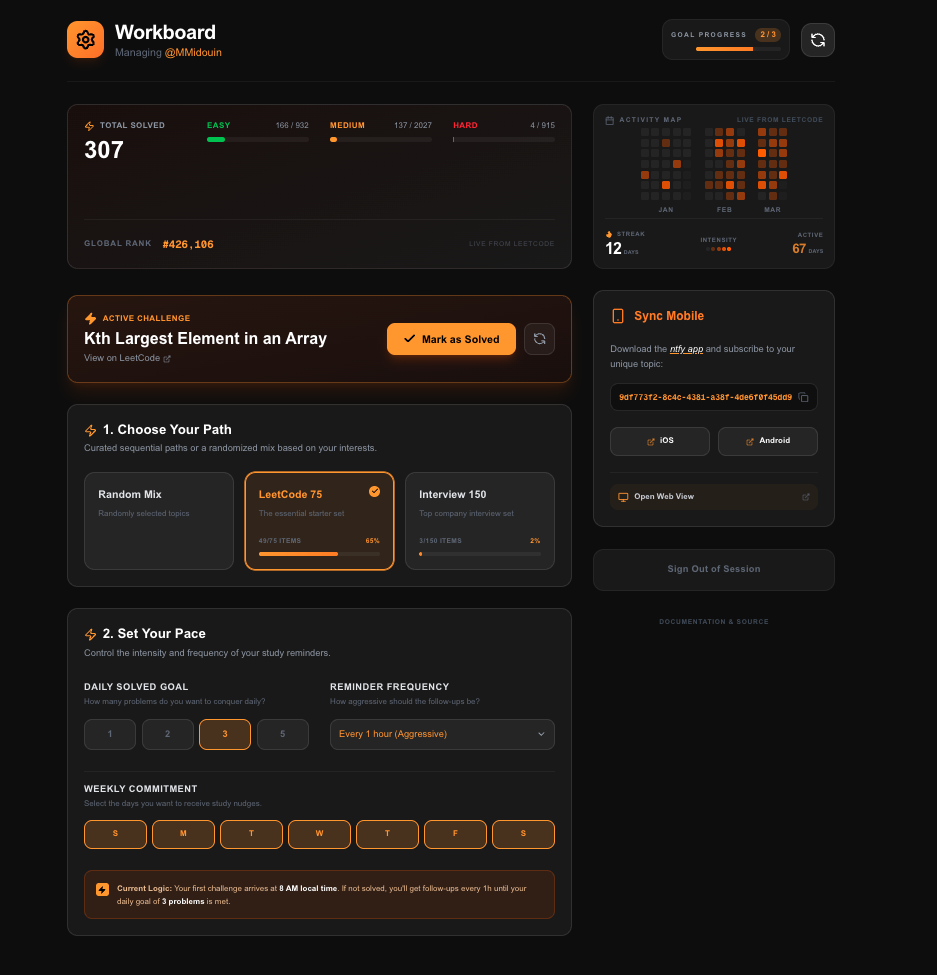

# LeetNtfy
<!-- last update: 2026-02-23 -->

## Table of Contents
- [Description](#description)
- [Sneak-Peek](#sneak-peek)
- [Getting Started](#getting-started)
- [Contributing](#contributing)
- [What I Learned](#what-i-learned)
- [Questions?](#questions)

## Description
**LeetNtfy** is a personalized LeetCode study notification system designed to keep you consistent with your coding practice. By leveraging the power of `ntfy.sh` and Supabase, LeetNtfy sends tailored algorithm challenges directly to your phone or desktop based on the topics you are currently studying.

This application simplifies the study workflow:
- **Live Activity Heatmap**: Real-time sync with your LeetCode submission history and streak.
- **Study Plan Support**: Seamlessly progress through official LeetCode Study Plans like "LeetCode 75".
- **No-Password Access**: Use a unique secret link to manage your settings.
- **Personalized Topics**: Add the topics you've recently studied to your "Random List" for targeted practice.
- **Group Nudging (Coming Soon)**: Stay motivated with shared goal tracking and collective nudging.
- **One-Tap Management**: Every notification includes a link to instantly adjust your settings.
- **Cloud Persistence**: Your progress and preferences are securely stored in Supabase.

## Sneak-Peek
### Screenshot



## Getting Started
### Prerequisites
- Node.js (v18+)
- npm or yarn
- A Supabase account and project
- The [ntfy](https://ntfy.sh) app installed on your device

### 1. Project Setup
Clone the project and install dependencies:
```bash
npm install
```

### 3. Environment Configuration
Create a `.env.local` file with your credentials:
```env
NEXT_PUBLIC_SUPABASE_URL=your-project-url
NEXT_PUBLIC_SUPABASE_ANON_KEY=your-anon-key
CRON_SECRET=super_secret_cron_key_123
NEXT_PUBLIC_APP_URL=http://localhost:3000
```

### 4. Database Schema
Initialize your Supabase database with the following table:

```sql
CREATE TABLE users (
  id uuid PRIMARY KEY DEFAULT gen_random_uuid(),
  leetcode_username text NOT NULL,
  secret_key uuid NOT NULL DEFAULT gen_random_uuid(),
  topics text[] DEFAULT '{}',
  notification_frequency text DEFAULT 'daily',
  timezone text DEFAULT 'America/New_York',
  difficulties text[] DEFAULT '{Easy, Medium}',
  schedule_days integer[] DEFAULT '{0,1,2,3,4,5,6}',
  daily_goal integer DEFAULT 1,
  nudge_interval integer DEFAULT 180,
  solved_today integer DEFAULT 0,
  solved_slugs text[] DEFAULT '{}',
  last_solve_at timestamptz,
  current_question_slug text,
  current_question_title text,
  last_notified_at timestamptz,
  last_reset_at text,
  study_plan_slug text,
  plan_progress jsonb DEFAULT '{}',
  created_at timestamptz DEFAULT now()
);

-- Indexes for performance
CREATE INDEX idx_users_secret_key ON users(secret_key);
CREATE INDEX idx_users_leetcode_username ON users(leetcode_username);
```

> [!TIP]
> If you already have the table and just need to add new columns, see [scripts/migration_v2.sql](file:///Users/makendymidouin/Desktop/GitHub Projects/leet-ntfy/scripts/migration_v2.sql).

### 5. Automated Notifications (Optional)
To automate notifications, set up a GitHub Action:
1. Go to your GitHub Repo -> **Settings** -> **Secrets and variables** -> **Actions**.
2. Add a **New repository secret**.
3. Name: `CRON_SECRET`, Value: (the same key used in your env vars).
4. The workflow in `.github/workflows/cron.yml` will now trigger your endpoint every hour.

### 6. Run Locally
```bash
npm run dev
```
Visit `http://localhost:3000` to get started.

## Contributing
Contributions are always welcome! Please feel free to submit a Pull Request.

## What I Learned
Building LeetNtfy provided hands-on experience in:
- **Serverless Notifications**: Integrating `ntfy.sh` for reliable, cross-platform push notifications without a complex backend.
- **Frictionless Auth**: Implementing a "Secret Link" authentication system to maximize user onboarding.
- **Next.js App Router**: Utilizing Server Components and Dynamic Routes for a fast, modern web experience.
- **Supabase Integration**: Managing relational data and real-time updates with ease.

## Questions?


For any questions, please contact me:
Email: <Midouinmakendy@gmail.com>

---
**About**
A personalized LeetCode study reminder that nudges you to practice the topics you care about. Built with Next.js, Supabase, and ntfy.sh.
